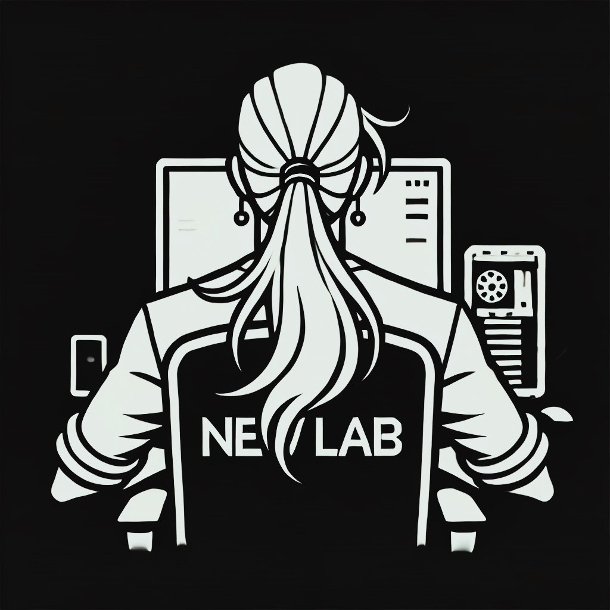

<h1 align="center">💻Software developer</h1>

###

<h2 align="center">🔗Organizations:</h2>

###

  

###

<h2 align="center">👨‍💻Technologies:</h2>

###

<h2 align="left">🖥️Languages:</h2>

###

  
  
  
  
  
  
  
  
  
  
  

###

<h2 align="left">⚙️Engines:</h2>

###

  
  
  
  
  

###

<h2 align="left">🤖Platforms:</h2>

###

  
  
  
  
  

###

<h2 align="left">🛠️Tools:</h2>

###

  
  
  
  
  
  
  
  
  
  
  
  
  
  
  
  
  
  
  

###

<h2 align="left">📂Libraries/Frameworks:</h2>

###

  
  
  
  
  

###

<h2 align="center">🌐Connect with me:</h2>

###

  
  

###
